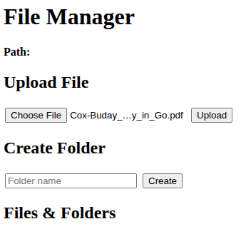
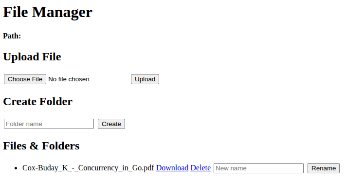
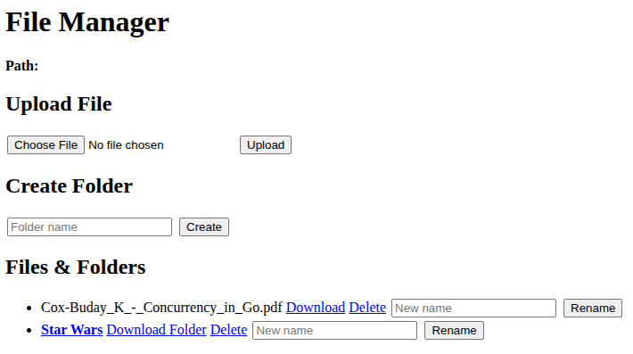
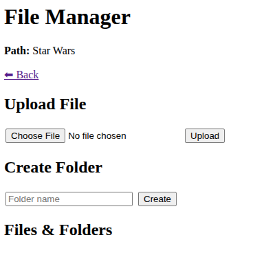
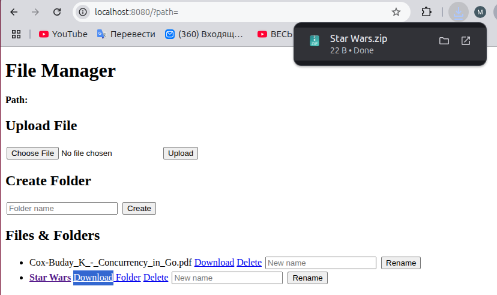
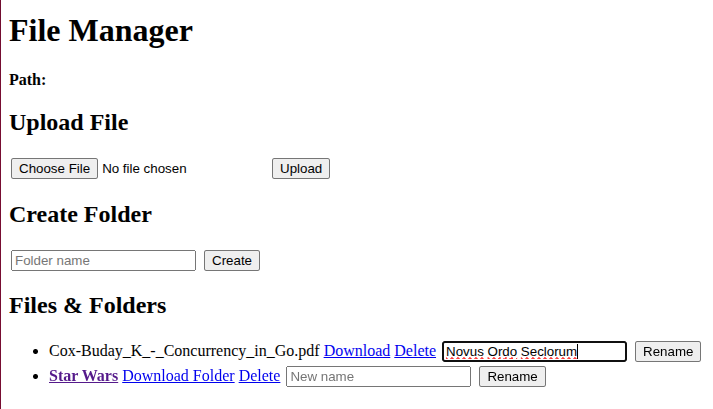
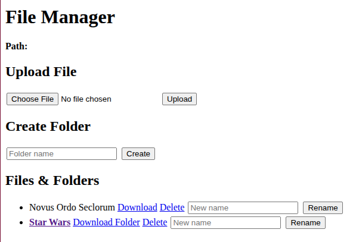

# Файловый менеджер в браузере

## Важные замечания

### Что есть в проекте на данный момент

#### Функциональность
##### Управление файлами
- **Загрузка файлов**: загрузка файлов в любую директорию относительно базового пути
- **Скачивание файлов**: скачивание файлов с правильными MIME типами и заголовками
- **Удаление**: удаление файлов и директорий (рекурсивно)
- **Переименование**: переименование файлов и папок с валидацией нового имени

##### Управление директориями
- **Создание папок**: создание новых директорий с автоматическим созданием родительских папок
- **Навигация**: просмотр содержимого директорий через веб-интерфейс
- **Скачивание папок**: скачивание директорий в виде ZIP архивов с сохранением структуры

### Особенности 

1) Старался выполнить проект по всем принципам чистой архитектуры
  - разделение на слои `adapters`, `usecases`, `domain`, `config`
  - каждый слой изолирован, легко тестировать
  - легко добавлять новые функции без рефакторинга нынешнего кода
2) Безопасность 
  - защита от атак на будущее (чисто для себя, потыкать) Path Traversal Protection, аалидация путей, валидация имен
3) Добавил нужные на мой взгляд ограничения для файлов и небольшую фильтрацию
  - ограничение размера файлов (можно задавать через config.yaml)
  - запрещённые расширения
  - двойная проверка размера, до и после чтения
4) безопасная обработка (тоже для будущего)
  - санитизация путей
  - проверка длины пути
  - скрытые файлы исключаются из zip архива
5) Архивация
  - автоматическое создание zip архива
  - относительные пути сохраняются в архиве
6) веб-интерфейс (простой, конечно)
  - позволяет просматривать файлы
  - загрузка файлов drag-and-drop
  - кнопки для ббыстрого действия
7) конфигурируемость
  - все параметры настраиваются через `config.yaml`
  - без перекомпиляции
  - пути API endpoints можно изменить в конфигурации
  - более подробно что можно настроить будет ниже
8) логирование и мониторинг
  - помню что сторонние библиотеки не стоит использовать, но мне визиуально приятно с помощью logrus
9) Развёртывание и контейнеризация
  - докер, докер кампос, изоляция
  - настроил ***volumes*** для persistent storage
10) тесты
  - про тесты можно глянуть в директории doc
11) Автоматизация
  - хотел прям баш скрипт прописать, но думаю на данном этапе хватит и Makefil
  - единная обработка ошибок
  - линтер
  - следования рекомендациям Google Go Style Guide
12) Различные оптимизации (память, скорость и тд)

### Этот проект можно делать вечно, например:
1) я бы добавил хранение метаданных в в постгресс (для хранения информации о файлах и папках,
имена файлов, пути, размеры, даты создания/изменения;
права доступа и владельцев для multi-user среды и тд)
2) удалённый доступ (поддержка безопасного HTTPS-соединения и тп)
3) поддержка облака
4) авторизация и управление доступом (аутентификация пользователей и управление ролями через тот же постгрес, ограничение доступа к файлам и папкам для конкретных пользователей и тд)
5) логирование действий пользователей и их операций (загрузка, удаление, переименование) в бд
6) улучшил бы интерфейс (превью файлов и тд)
7) расширенные функции поиска и фильтрации (поиск файлов по имени, размеру, дате создания или расширению, Фильтрация и сортировка в веб-интерфейсе для удобного управления большими каталогами)

#### P.S. Хранилище storage создается пока в корне проекта, но в config.yaml можно настроить под себя

## Как запустить проект?

- Если у вас установлен Make просто запустите комманду `make run`
- Если у вас нет установленного Make, пропишите комманду `docker-compose up --build -d`
- Если у вас нет Docker, docker-compose, запустите проект вручную, пропишите комманду `go run cmd/main.go`

## Как работать с веб-интерфейсом?

***Path*** - показывает в какой директорий вы находитесь относительно директория ***storage***

### Аллгоритм действий

1) Чтобы добавить файл нажмите на ***Choose File***

2) Затем нажмите на ***Upload***

3) Чтобы создать новую директорию, пропишите название в ***Folder name***, затем нажмите на ***Create***

4) Чтобы перейти в новую директорию нажмите в название созданного директория, например ***Star Wars***

***Path показывает в какой директорий вы находитесь***

5) Чтобы скачать файлы необходимо нажать на ***Download***

***Папки скачивается zip архивом, файлы в формате в котором вы сохранили ***

6) Чтобы переименовать файл в ***New name*** наберите новое название файла

## CТЕК ТЕХНОЛОГИЙ

### Язык и платформа
- **Go 1.24.4** - основной язык программирования

### Стандартная библиотека Go
- **net/http** - HTTP сервер, обработка запросов и маршрутизация
- **context** - управление контекстом для graceful shutdown
- **os/signal, syscall** - обработка системных сигналов
- **os** - работа с файловой системой
- **io** - работа с потоками ввода/вывода
- **path/filepath** - безопасная работа с путями файлов
- **html/template** - рендеринг HTML шаблонов
- **archive/zip** - создание ZIP архивов
- **mime** - определение MIME типов файлов
- **regexp** - валидация имён файлов регулярными выражениями
- **strings** - работа со строками
- **fmt** - форматирование вывода
- **errors** - обработка ошибок
- **time** - работа со временем

### Внешние зависимости
- **github.com/sirupsen/logrus v1.9.3** - структурированное логирование
- **gopkg.in/yaml.v3 v3.0.1** - парсинг YAML конфигурации
- **github.com/stretchr/testify v1.11.1** - библиотека для тестирования

### Инструменты разработки
- **Docker** - контейнеризация приложения
- **Docker Compose** - оркестрация контейнеров
- **golangci-lint** - статический анализ кода
- **Make** - автоматизация задач сборки и запуска

### Архитектура
- **Clean Architecture** - разделение на слои: adapters, usecases, domain, config
- **Интерфейсы** - абстракция через FileStorage и FileManagement для гибкости и тестируемости

